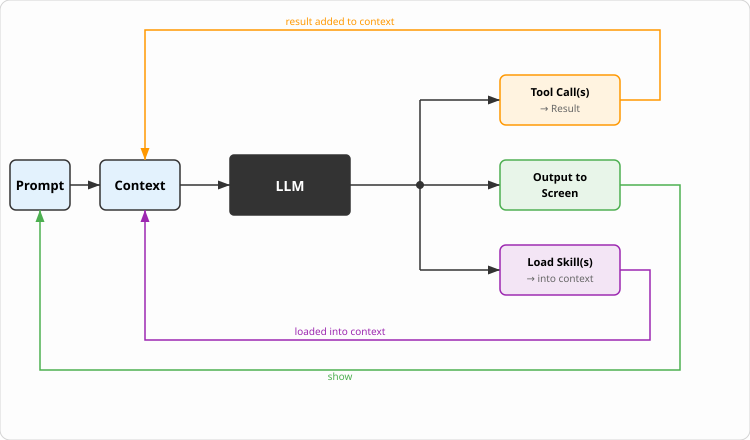

## TL;DR

Use least privilege + isolation:

- need a Windows guest: vagrant
- really only need a simple sandbox with a Linux guest: docker sbx
- everything else: vagrant


## What to expect

This is not another FOMO article about the shiny new tool that makes you a 100x dev.

It's also not an explainer on how to use %insert-your-favourite-agent-harness-here% effectively or efficiently. There's plenty of that already (some of it even good, or so I am told).

This is about running it *less insecurely* (yes, there is a difference from "more securely"; please don't get me started, I haven't ranted about that topic to anybody for at least 2.8 days).

You need to discover what your way of working actually requires and then do your own threat modelling. You may come to the conclusion that running locally is completely fine. Or you may come to the conclusion that not even air-gapping is good enough.

Basically: we get to (re)discover the principle of least privilege.

Oh, and another disclaimer: parts of this post might read a bit like a rant. That's because parts of this post are a rant. I get grumpy when (apparently) trillion-dollar companies repeatedly make security-critical mistakes you would expect from a junior in, say, 1995.

{/* truncate */}


## ~~Remote Code Execution Vulnerability~~ Agent-loop

... or why all this sandboxing overhead might be required.

You might remember when those LLMs first gained popularity. Back then it was a rather simple chat-like interaction flow: you sent off some text, maybe containing code, and you received some generated text as an answer.
For SW-Engineers that meant copy-pasting code, or manually pasting scripts and commands and executing them.
That might be fine for a start, or forever for some use cases, but not for others.

Some use cases really benefit when this loop can be done (in part) by the agent-harness itself, instead of by the user.

Loop:

- respond with text
- do something with it, like execute a command
- see the output of the command
- repeat

That's what we call the "agent loop" for this article.



But that means the agent-harness now needs to execute code on our system. Potentially with the same permissions as our user. Potentially interacting with external systems as, or on behalf of, our user.

The model emits "run `grep -rn TODO src/`", the harness runs it on your machine, the output goes back into the context, and the loop turns again.
`grep` seems rather harmless. But what about `rm`? Or what if you have sensitive data on your machine which should not be the target of a grep, or sensitive data on a share that happens to be mounted?

So the capabilities we actually *want* are:

- read from and write to any file anywhere, apart from the ones we don't want it to
- run any shell command, apart from the ones which are bad
- read anything on the internet, apart from the bad stuff
- read anything on the internal network or in any communication tool, apart from the sensitive stuff (and some other things)

And do all of this without asking for permission, because continuously telling it "yes" is tiring and leads to permission fatigue.

Seems about right? Ok, if you can figure that out and come up with a solution, congrats. You probably just solved a hugely difficult problem. To me it feels similar to the undecidability of the halting problem: deciding whether you need to ask or are just allowed is itself already a decision.


## Built-in "security" mechanisms

Ok, so this agent-harness can execute commands on your system. That sounds like a security risk.

What do you do if your model reads stuff it shouldn't? You tell it off. Bad Opus, bad! Don't read the dev's ssh keys and force push into production.

Hmm, ok, that seemed to not do it. Well, the next step is to use an allow and deny list, right? So we say you're only allowed to execute harmless tool-calls like `Read`, or `Bash(grep*)` or `Bash(find*)`.
They are harmless, right? Yes, definitely nothing bad happening here. You didn't see anything. Just smile and wave.

```bash
find / -maxdepth 1 -type d -exec rm -rf {} \;
```

Oh I know, we can transfer the responsibility over to the user. Because users know how to protect their systems. Like, they always keep their systems up to date. They would never run an unpatched system directly on the internet, for example.
Dear reader, I think you know where this is headed, so let's skip ahead... That idea also didn't work out.

Anthropic introduced a so-called auto-mode a couple of months ago, and it is now the default mode.
So what does it do? Oh well, you know: asking the model to police itself didn't work, trying to regex your way through didn't work, asking the user to police the tool-calls didn't work. But asking a **different** model to police the first model surely will.

And so was born the auto-mode: for any tool-call request the active model wants to make, the harness first goes through the allow and deny lists and then asks a second model whether the command should be allowed to execute.

Let's involve the reader again for a second. So if I told you that we failed to solve a problem with AI, would you suggest "Have you tried using more AI?" No? Ok... well... ok, carry on then.

Suffice to say, the problem isn't really solved. I personally seem to have no problem letting the agent accidentally delete a worktree, delete untracked files, or install highly trustworthy 2-star, 17-commit npm dependencies.

&lt;/rant&gt;

Neither the allow list nor the changed default seems to be a particularly good solution, though.
For me personally, the better solution would be to start with least privilege, i.e. the harness doesn't have access to anything, but enforce that using OS-level permissions and tooling.
Once you have worked with the agent-harness for a bit and learned how it behaves, you can still extend what it has access to.

Some of those agent-harnesses come with an internal sandbox. Which goes in that direction. But it is either not turned on by default, still in alpha state, or not sandboxing the whole thing (more on that later).


## Examples of security risks

The tool-calls that the model requests run as your user, in your shell, with your environment. So if your user has access to sensitive data, the model potentially has access to sensitive data.

Undesirable text can get into the LLM context either by someone maliciously placing it there via prompt injection, or just by a bad answer in a Stack Overflow thread.

A non-exhaustive list, in no particular order (definitely not in the order they happened to me or my colleagues + some bonus ones *hint hint*).

### Work Lost Because of Deletion

The agent decides that there are still some leftovers from another agent, and that it needs to clean up your working tree before it starts its own work.

```bash
git reset --hard
git clean -xfd
```

### Spring Cleaning Your C: Drive

You've asked your agent to clean up the build and test output of a previous run.
It generates a command and executes it.
A few minutes into the run, you notice files being deleted which look like entries in your recycling bin.
@jerry note: add command from slides.marp, ie confusion around powershell and cmd quote escaping

The command was improperly escaped, and instead of `C:\project\foo\bar\testrun` it deleted `C:\` and `project\foo\bar\testrun`.

In this (definitely) hypothetical example, the person was lucky enough to notice and could stop the execution.

### Spring Cleaning Your Emails

This one is not hypothetical, and it did not happen to somebody careless.

In February 2026, Summer Yue, Director of Alignment at Meta Superintelligence Labs, pointed an agent at her inbox with what reads like exactly the right prompt:

> Check this inbox too and suggest what you would archive or delete, don't action until I tell you to.

It deleted emails anyway. Her own explanation afterwards:

> This has been working well for my toy inbox, but my real inbox was too huge and triggered compaction. During the compaction, it lost my original instruction.

Because the context no longer contained the instruction to NOT do something, and it had permissions to DO something, it actually did something. Sadly that something was "spring cleaning your emails".
In this example there was no malicious actor involved. Still: the outcome was at best quite annoying.

### Secrets Sitting in or Next to the Code

Worst case: you have committed secrets. Stop reading here, revoke them, rotate them, and adapt your process so it doesn't happen again. (Then come back to this blog, please :) )

BUT you might have secrets in uncommitted `.env` files or similar.
Your agent might just find them and use them, because it tries to be helpful. Say it notices a local PAT for Azure DevOps in a `.env` file and uses it to do a NuGet restore.
That was actually helpful, but also scary: that PAT might have far more permissions than the one job it just did.

### Access Tokens on Your System

You probably have at least one of these on your host:

```text
~/.ssh/
~/.npmrc
~/.docker/config.json
~/.nuget/NuGet/NuGet.Config
```

Should your agent have access to all of them?

### Your Code, If You Consider It a Trade Secret

Files the agent reads go into the context, and the context is sent to the provider for inference.

### Malicious Code Running on Your Host

`npm install` of whatever package the agent picked. `apt-get install` to fix a build error. `curl https://... | bash` off a docs page it just read.
Some of the recent npm-related takeovers used post-installation scripts.


## Mitigations

Least privilege.

Your agent-harness doesn't (usually) need access to your whole system or even to connected systems. And it should definitely not have access to other systems with the same permissions as you.

There are two parts to least privilege in this context:

The sandboxing part focuses more on where the agent-harness runs, what directories it can see, and maybe what networks it can reach.

The permissions limit what the agent-harness can actually do. E.g. can it read from a private git repo on GitHub, can it push to some git repo, can it create a ticket, can it read from a production DB...

### Sandboxing

There are a couple of options:

1. built-in sandbox
2. devcontainer or plain docker
3. docker sbx
4. (vagrant) vm

#### 1. built-in sandbox

An "ok" first step. Most agent-harnesses come with one. They don't enable it by default. And they mostly don't work on Windows.

It usually uses OS-level permissions and techniques to sandbox the tool-calls. But **only** the tool-calls.
That means we trust the agent-harness to not have any other logic which reads things it should not, and to not have bugs where it forgets to route tool-calls through the sandbox.

The techniques used are usually a sandboxing library like bubblewrap + a network proxy.

#### 2. devcontainer or plain docker

Also a good first step. But more effort.

Drawback: by default, devcontainers volume-mount the repo. That means you give the agent-harness access to files excluded by `.gitignore`, which may contain secrets, e.g. `.env` files.

Container-in-container is also sometimes an issue. For example, if your system itself runs in containers.
No network proxy by default.
Also: I have yet to meet a dev using Windows who can tell me with a straight face that they don't have issues with Docker on Windows.

#### 3. docker sbx

Quite a good solution. Use the `--clone` option to ensure you don't make ignored `.env` files accessible.

Surprisingly, every single dev that I talked to got this running in under 10 minutes (even on Windows).
That alone makes it a pretty awesome solution.

It also ships with a network proxy and a set of preconfigured allow lists.
And it has the option to keep access tokens out of the "container" by automatically appending them to the outbound REST requests.

Drawback: you cannot use Windows guests.

See [the appendix](/sandbox-appendix#b-docker-sbx) for how to get started.

#### 4. (vagrant) vm

The heaviest approach. Similar isolation to docker sbx. Windows guest available.

No built-in network proxy.

You should probably use vagrant for provisioning. That way you have a repeatable setup.

My company offers courses on agentic coding, which a colleague and I run. We ask the participants to have a docker sbx or vagrant-based setup prepared.
Around 70% of the Windows users have had issues with the vagrant VM approach. Mostly not because of vagrant itself, but because of the virtualization provider, like VMware, VirtualBox or Hyper-V. And mostly network-related.
Once it worked, it mostly worked fine. But be warned.

See [the appendix](/sandbox-appendix) for the setup instructions and both `Vagrantfile`s.

### Permissions

This part really depends on how "autonomously" you want to run your agent-harness.

#### Start with zero

I suggest you start with basically zero permissions. That means your agent-harness only has access to your Claude Code token (if at all, see docker sbx).
That means that your workflow would look something like the following:

1. Choose a thing you want to work on
2. In the guest: tell the agent-harness to use a worktree and make the change
3. Once it is finished, on your host: fetch the branches (by adding the guest sandbox as a second remote)
4. Review and test the changes
5. Findings? Fix them yourself or ask your agent to do so (by pushing to that remote and then fetching again)
6. Follow your usual process, like creating a PR on origin

#### Slowly increase permissions to enable different workflows

After some time you probably want the agent-harness to be able to discover some of the information itself, without you having to forward it.
For example, you might want to let it read GitHub issues or ADO tickets, so you don't need to copy-paste the information.
You might want it to read PR comments, so you don't need to forward the findings.

Here you would create a PAT with a very limited set of permissions in the system of your choice.
Then make it available to the agent-harness. For example, via a `.env` file and a description of how to use it in a skill or `AGENTS.md`/`CLAUDE.md` etc.

Why no MCP?
At the time of writing, the available MCP servers for GitHub and similar don't have the functionality to limit permissions. The GitHub one, for example, has full permissions for all your repos. Not an amazing security choice, I would say.
If that has changed, reevaluate the choice of MCP vs. PAT.

#### What about write permissions?

So far we still haven't allowed the agent to actually write to any of our systems.
Wouldn't it be nice if it could create a PR, close tickets, automatically create bugs when it finds something during an implementation...

I suggest that you either don't go there at all, or have an actual, real, up-to-date threat model in place + actually live Dev**Sec**Ops.

I can't prevent you from doing so. The process is basically the same; you can just extend the permissions in your PAT or MCP etc.

Here is just a taste of the risks it can bring: You run CI on your own hardware? It can now execute code on that hardware, because it can trigger PRs for code it wrote. You don't, but you have connected external systems like observability or even prod deployments to your CI/CD? Well, it now has access to that.

An intermediate step, however, could be that you basically mirror your "online working environment" for the agent-harness, give it write permissions there, and let it create draft PRs into your real repo.

In ADO that would mean you create a new project on which the agent-harness has write permissions. In it you fork the original repo. The agent-harness has read permissions on the original project.
That means it can read tickets, PRs etc., but it can also automatically interact with the forked repo.


## Aaargh! This is all so complicated — do I really need all this?

I don't know, but probably yes.

As I said at the start, you have to identify the security risks a potential workflow can have, and you have to assess them. Standard risk management.
Or... you know... just do what all the cool kids do: ignore good practices and run yolo mode on your work laptop, the one with access to customer data.

Start off with least privilege and get to know the agent-harness and the sandbox tooling. Find out which workflow actually works for you. Then slowly adapt.

Use the tool to improve the tool.
For example, ask it to write some helper scripts to reduce friction when using these sandboxes.
Or use it to get a running start by adapting your docker sbx or vagrant sandbox to have all the required tooling pre-installed.

I hope some of the parts between all the ranting were helpful to you. If you just came for the ranting, strange, but thanks as well.

This blog post began when, many moons ago, I started to use claude code more intensively.
After some discussions with my peers, we came to the conclusion that running it locally was too much of a security risk for us.
Because there were no built-in sandboxes available yet and docker sbx wasnt out yet either, I just built my own, based on vagrant. 
This iterated a couple times, and included colleagues using the same solution. The one in [the appendix](/sandbox-appendix). 
Then it eventually grew into a full blown course on how to use this tooling for agentic-coding.
If you want to learn more about the whole agentic-coding topic, give [the course description](https://bbv.ch/academy-detail/53654303/agentic-coding-mit-teilautonomen-cli-agents/) a read.


## Appendix

Both `Vagrantfile`s and the setup instructions are in [the appendix](/sandbox-appendix).


## Attributions

**Content:** Jeremy. Proofread by Claude (LLM by Anthropic)

**Cover image:** Chat-gpt

**Code examples:** Jeremy. Licensed under MIT
